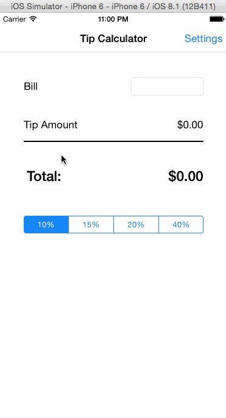

# TipCalculator

## Overview
This is an iOS application for calculating tips.

Time spent: 10 hours spent in total

Completed user stories:

Required: 
Required: User can input bill amount, select tip percentage (10%, 15%, or 20%) to calculate the total payment.
Required: Added Setting page. User can change the default tip percentage amount when the application is loaded.
Optional: Added an option for user to set their own custom percentage other than the 3 default amounts. The custom percentage is retained when application is closed.

Walkthrough of all user stories:

GIF created with LiceCap.
